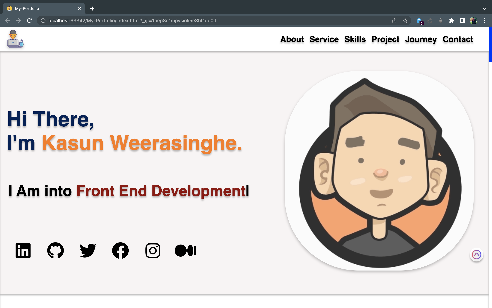
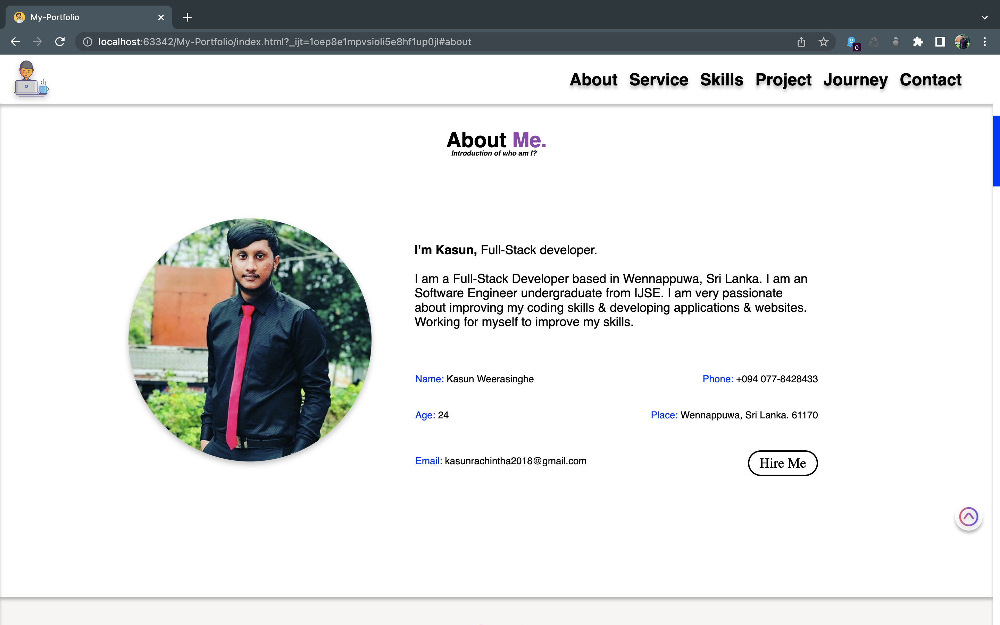
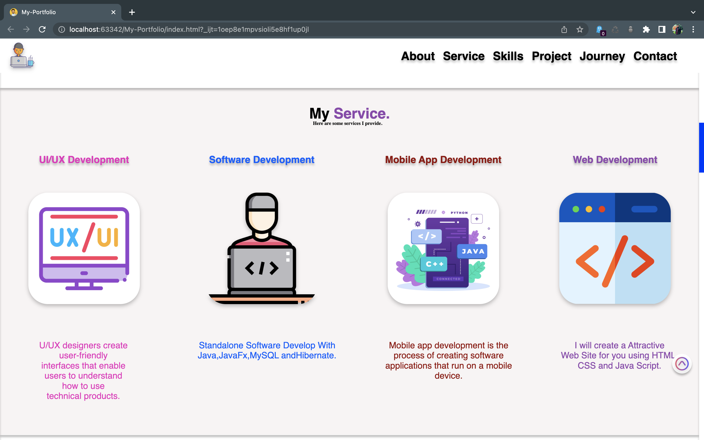
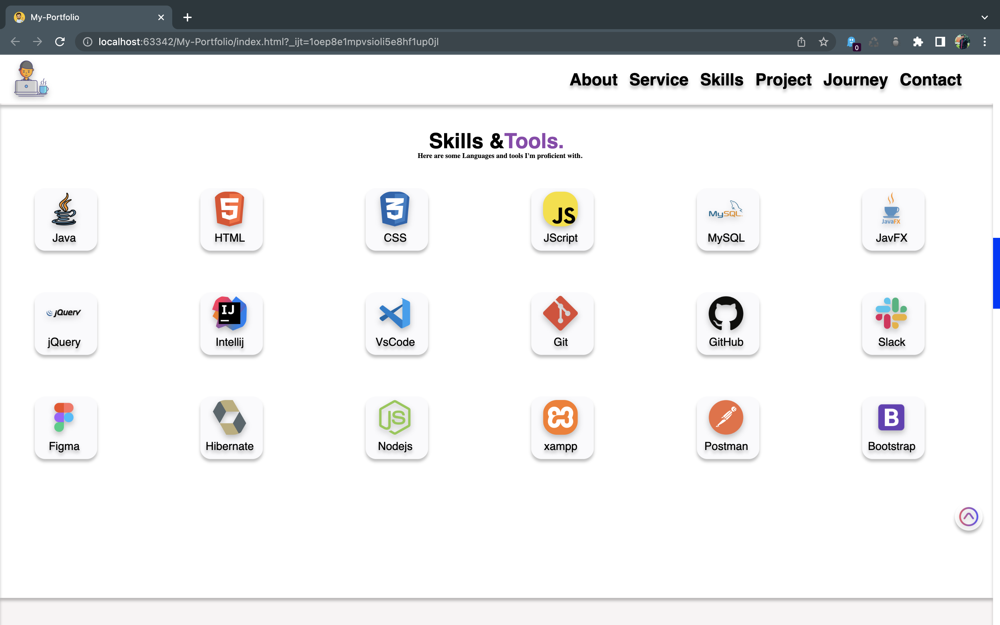
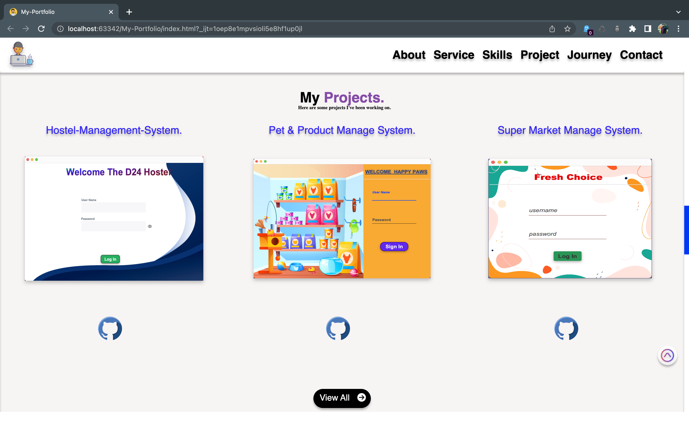
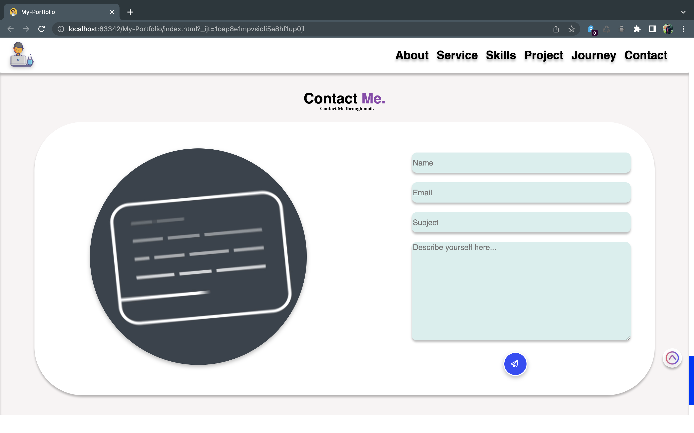
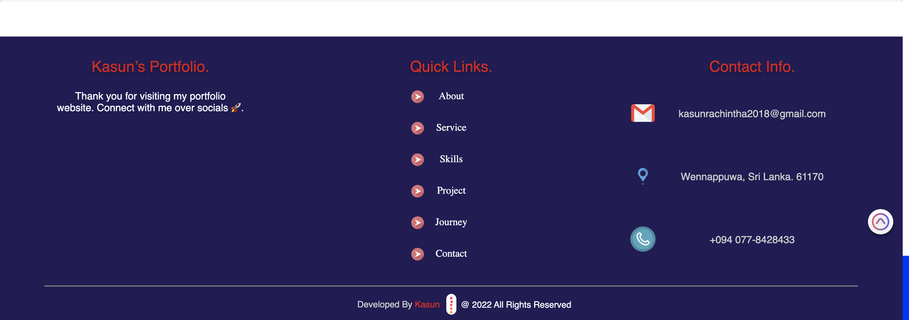
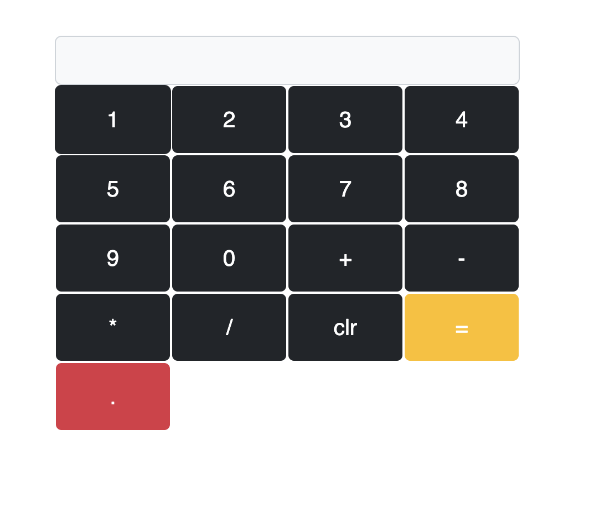

# My-Portfolio

---
### Description.

#### This website shows some information about my career.I categorize them into sections.
* Home Page.
* About Me.
* services  I provide.
* Top Skills.
* Top Skills.
* Projects I have done.
* My journey so far.
* Contact Details.

#### This website is Optimized to Provide for All Mobile & Desktop Devices you Can View.

---

# Reference Links
📍 Site-Map:
https://www.gloomaps.com/FAksqDjpil

🕸️ Wire-Frame: https://wireframe.cc/EmWEaj

️️🖼️ Mock Up: https://www.figma.com/file/dcnDBMDldGN8Z3bgiEhHNV/portfolio?node-id=137%3A2

🌐 Infinity Free: http://kasun-weerasinghe.epizy.com/

📃 GitHub Page URL: https://kasunweerasinghe.github.io/My-Portfolio/

🔗 Linked-in URL: https://www.linkedin.com/in/kasun-rachintha-weerasinghe-7353171a5/

---
# Portfolio View.
profile

About

Service

Skills

Project

Contact

Footer

---
### Languages

* HTML
* CSS
* Java Script
---

# Web-POS System (Bootstrap)

---
### Description.

#### SPA POS System. can Manage customers and items and place an order.
* Dashboard.
* Customer.
* Items.
* Place Order.
* Order Details.

---
# Reference Links

🗺️ Site-Map: https://www.gloomaps.com/sb9PfmQHek

🪟 Wire-Frame: https://wireframe.cc/WEbRA4

️️🖼️ Mock Up: https://www.figma.com/file/RianM4wuNqd5DYKZLLdM17/Web-POS-System?node-id=0%3A1

---
# SPA POS View

Dashboard Before Adding anything to the system

Customer Section Before Add customers.

After customer Add.

Item Section Before Add Items.

After item Add.

Order section Before placing an order.

After selecting the customer id and item code.

After adding the customer and item detail cart table.

Enter cash and discount and press Place order.

Order detail Table after order complete.

Dashboard after adding customers and items and placing orders.

---
### Technology & Framework

* HTML
* CSS
* Java Script
* jQuery.
* Bootstrap
---

# calculator

---
🔗 link: https://web-cal.pages.dev/

---
### Technology & Framework

* HTML
* CSS
* Java Script
* Bootstrap
---

