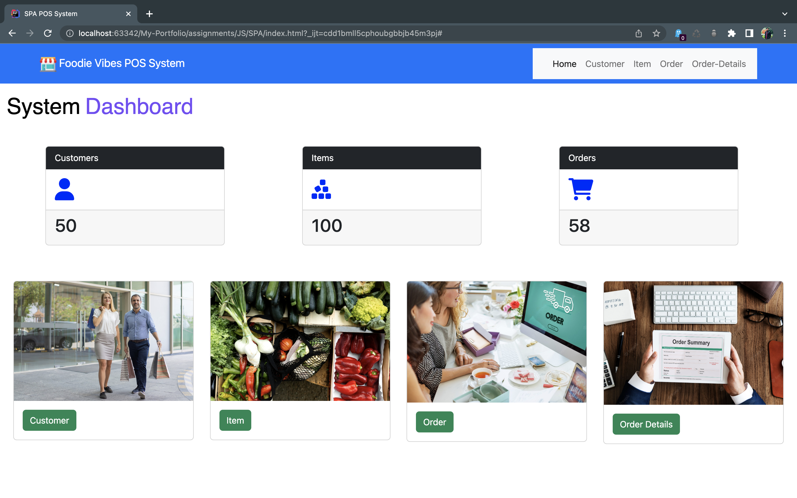
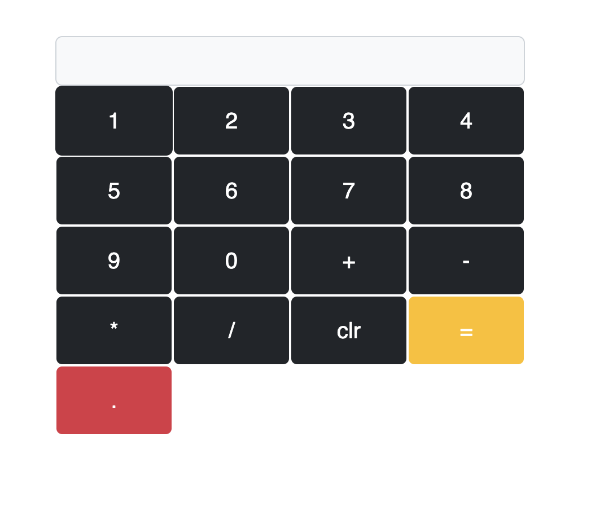

# My-Portfolio

---
### Description.

#### This website shows some information about my career.I categorize them into sections.
* Home Page.
* About Me.
* services  I provide.
* Top Skills.
* Top Skills.
* Projects I have done.
* My journey so far.
* Contact Details.

#### This website is Optimized to Provide for All Mobile & Desktop Devices you Can View.

---

# Reference Links
📍 Site-Map:
https://www.gloomaps.com/FAksqDjpil

🕸️ Wire-Frame:
https://wireframe.cc/EmWEaj

️️🖼️ Mock Up:
https://www.figma.com/file/dcnDBMDldGN8Z3bgiEhHNV/portfolio?node-id=137%3A2

🌐 Infinity Free:
http://kasun-weerasinghe.epizy.com/

📃 GitHub Page URL:
https://kasunweerasinghe.github.io/My-Portfolio/

🔗 Linked-in URL:
https://www.linkedin.com/in/kasun-rachintha-weerasinghe-7353171a5/

---
# Portfolio View.

---
### Technology

* HTML
* CSS
* Java Script
---

# Web-POS System (Bootstrap)

---
### Description.

#### SPA POS System. can Manage customers and items and place an order.
* Dashboard.
* Customer.
* Items.
* Place Order.
* Order Details.

---
# Reference Links

🗺️ Site-Map: https://www.gloomaps.com/sb9PfmQHek

🪟 Wire-Frame: https://wireframe.cc/WEbRA4

️️🖼️ Mock Up: https://www.figma.com/file/RianM4wuNqd5DYKZLLdM17/Web-POS-System?node-id=0%3A1

---
# SPA POS View

---
### Technology & Framework

* HTML
* CSS
* Java Script
* jQuery.
* Bootstrap
---

# calculator

---
🔗 link: https://web-cal.pages.dev/

---
### Technology & Framework

* HTML
* CSS
* Java Script
* Bootstrap
---

